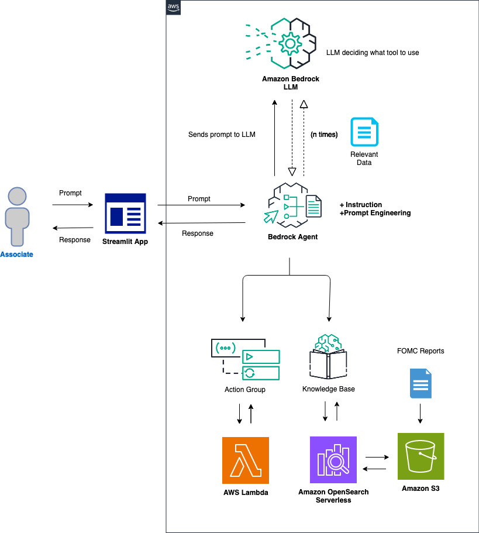
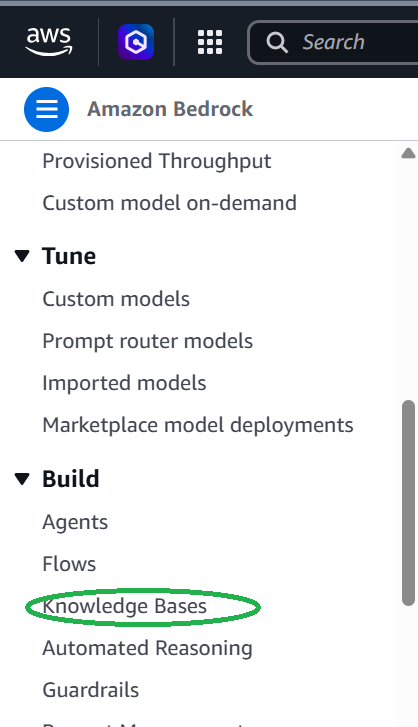
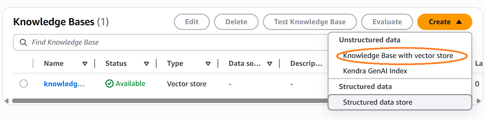
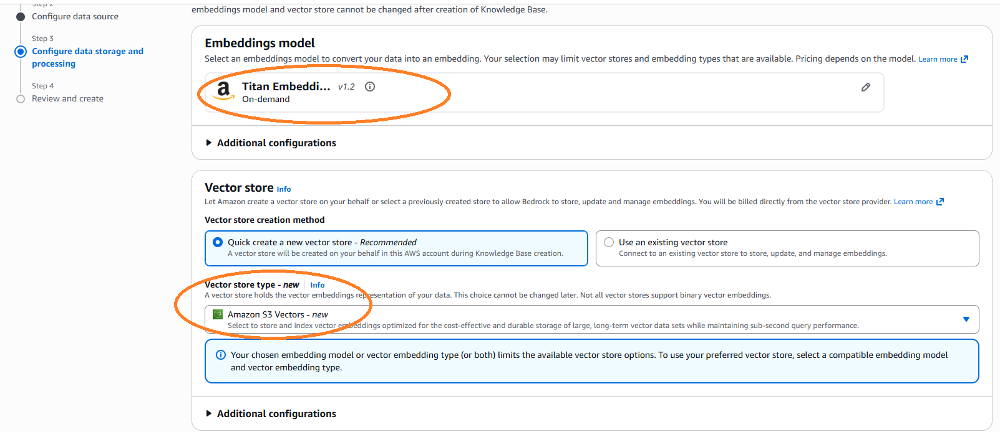
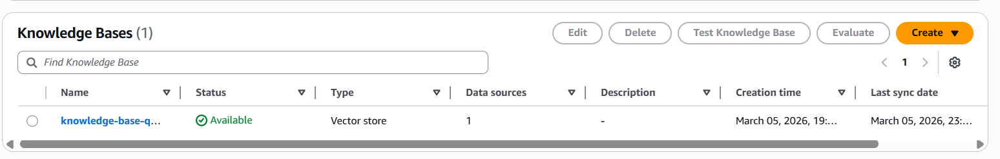
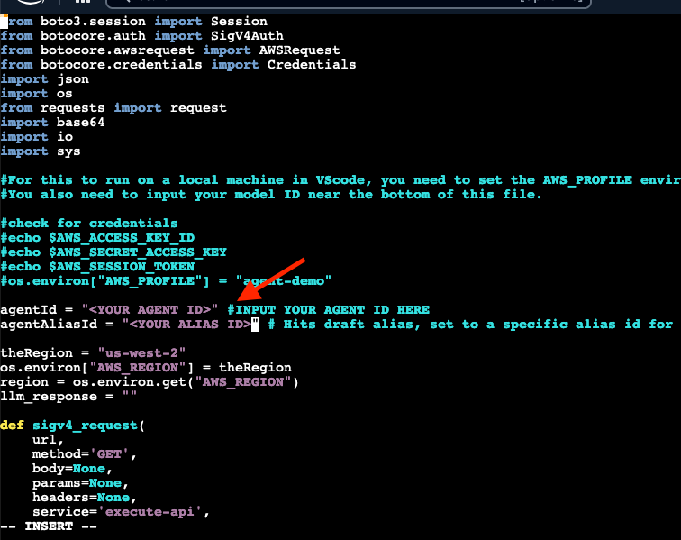
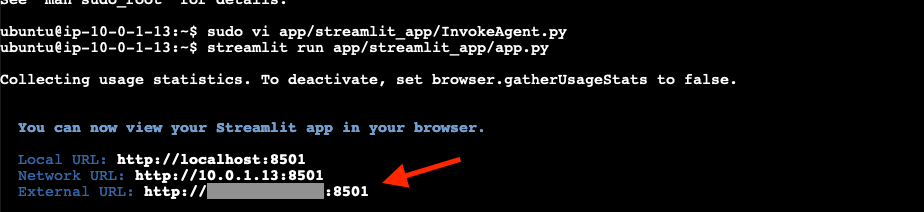
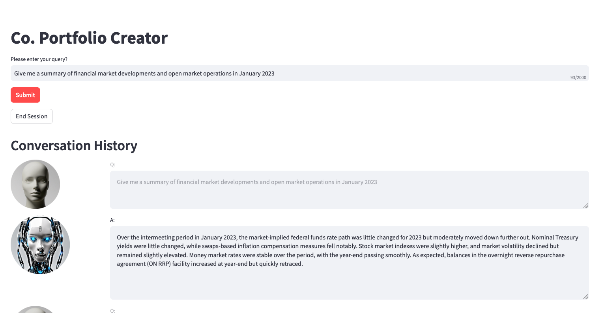

## Architecture Overview And High Level Design

## Architecture

This repository demonstrates setup process of an application that will use an agent on Amazon Bedrock



## The solution consists of:

AWS S3 bucket which will be used to store the domain data that the Agent will later use to answer domain specifc questions

Amazon Bedrock Knowledge Base with S3 Data Source, S3 Vector Database, Titan Embedding Model

AWS Lambda function which serves as a backend API for the AI agent

Amazon Bedrock Agent and Action Group

EC2 Instance to run Streamlit UI


## High Level Design.

## Overview
In this project, we will set up an Amazon Bedrock agent with an action group that dynamically creates an investment company portfolio based on specific parameters. The agent also has Q&A capabilities for Federal Open Market Committee (FOMC) reports, leveraging a Streamlit framework for the user interface. 

This README will walk you through the step-by-step process to set up the Amazon Bedrock GenAI agent manually using the AWS Console.

## Setup

### Step 1: Creating S3 Buckets
- Please make sure that you are in the **us-west-2** region. If another region is required, you will need to update the region variable `theRegion` in the `invoke_agent.py` file code. 
- **Domain Data Bucket**: Create an S3 bucket to store the domain data. For example, call the S3 bucket `knowledgebase-bedrock-agent-{alias}`. We will use the default settings.

Give {alias} in bucket name as some unique text

Once bucket create successfully. Upload the pdf files from S3docs directory in this repository to S3 bucket.
These files are the Federal Open Market Committee documents describing monetary policy decisions made at the Federal Reserved board meetings. The documents include discussions of economic conditions, policy directives to the Federal Reserve Bank of New York for open market operations, and votes on the federal funds rate.

### Step 2: Knowledge Base Setup in Bedrock Agent

Please make sure you are not logged in as root user to create KB. If yes, create a admin user in IAM and then proceed with below steps to create KB.

Open Amazon Bedrock and Navigate to Knowledge Bases under Build



selecting the orange button **Create knowledge base** with dropdown option **Knowledge Base with Vector Store**



You can use the default name, or enter in your own. Then, select **Next** at the bottom right of the screen keeping all default values as it is

Configure S3 database as Data Source by providing S3 Uri as S3 bucket created to store pdf data. Rest Keep Default and press Next

For the embedding model, choose **Amazon: Titan Embeddings G1 - Text**. Choose Vector Store type as **Amazon S3 Vectors** and scroll down to select **Next**.



- On the next screen, review your work, then select **Create knowledge base**
(Creating the knowledge base may take a few minutes. Please wait for it to finish before going to the next step.)

Once your Knowledge Base is created successfully. you can that listed in Konwledge bases as below

 
 
### Step 3: Lambda Function Configuration
- Create a Lambda function (Python 3.14) for the Bedrock agent's action group. We will call this Lambda function `PortfolioCreator-actions`.


- Copy the python code from the file **ActionLambda.py** into your Lambda function.

- Then, select **Deploy** in the tab section of the Lambda console.

- Next, apply a resource policy to the Lambda to grant Bedrock agent access. To do this, we will switch the top tab from **code** to **configuration** and the side tab to **Permissions**. Then, scroll to the **Resource-based policy statements** section and click the **Add permissions** button.


- Select ***AWS service***, then use the following settings to configure the resource based policy:

* ***Service*** - `Other`
* ***Statement ID*** - `allow-bedrock-agent`
* ***Principal*** - `bedrock.amazonaws.com`
* ***Source ARN*** - `arn:aws:bedrock:us-west-2:{account-id}:agent/*` - (Please note, AWS recommends least privilage so only an allowed agent can invoke this Lambda function. A * at the end of the ARN grants any agent in the account access to invoke this Lambda. Ideally, we would not use this in a production environment.)
* ***Action*** - `lambda:InvokeFunction`


- Once your configurations look similar to the above screenshot, select ***Save*** at the bottom.


### Step 4: Setup Bedrock Agent and Action Group 

- Navigate to the Bedrock console. Go to the toggle on the left, and under ***Builds*** select ***Agents***. Provide an agent name, like ***PortfolioCreator*** then create the agent.

- The agent description is optional, and we will use the default new service role. For the model, select **Anthropic: Claude 3 Haiku**. Next, provide the following instruction for the agent

```instruction
You are an investment analyst. Your job is to assist in investment analysis, create research summaries, generate profitable company portfolios, and facilitate communication through emails. Here is how I want you to think step by step:

1. Portfolio Creation:
    Analyze the user's request to extract key information such as the desired number of companies and industry. 
    Based on the criteria from the request, create a portfolio of companies. Use the template provided to format the portfolio.

2. Company Research and Document Summarization:
    For each company in the portfolio, conduct detailed research to gather relevant financial and operational data.
    When a document, like the FOMC report, is mentioned, retrieve the document and provide a concise summary.

3. Email Communication:
    Using the email template provided, format an email that includes the newly created company portfolio and any summaries of important documents.
    Utilize the provided tools to send an email upon request, That includes a summary of provided responses and portfolios created.
```


- After, scroll to the top and **Save**

- The instructions for the Generative AI Investment Analyst Tool outlines a comprehensive framework designed to assist in investment analysis. This tool is tasked with creating tailored portfolios of companies based on specific industry criteria, conducting thorough research on these companies, and summarizing relevant financial documents. Additionally, the tool formats and sends professional emails containing the portfolios and document summaries. The process involves continuous adaptation to user feedback and maintaining a contextual understanding of ongoing requests to ensure accurate and efficient responses.

- - Next, we will add an action group. Scroll down to `Action groups` then select ***Add***.

- Call the action group `PortfolioCreator-actions`. We will set the `Action group type` to ***Define with API schemas***. `Action group invocations` should be set to ***select an existing Lambda function***. For the Lambda function, select `PortfolioCreator-actions`.

- For the `Action group Schema`, we will choose ***Define via in-line schema editor***. Replace the default schema in the **In-line OpenAPI schema** editor with the schema provided below. You can also retrieve the schema from the repo [here](https://github.com/build-on-aws/bedrock-agent-txt2sql/blob/main/schema/athena-schema.json). After, select ***Add***.
`(This API schema is needed so that the bedrock agent knows the format structure and parameters needed for the action group to interact with the Lambda function.)`

```schema
{
  "openapi": "3.0.1",
  "info": {
    "title": "PortfolioCreatorAssistant API",
    "description": "API for creating a company portfolio, search company data, and send summarized emails",
    "version": "1.0.0"
  },
  "paths": {
    "/companyResearch": {
      "post": {
        "description": "Get financial data for a company by name",
        "operationId": "companyResearch",
        "parameters": [
          {
            "name": "name",
            "in": "query",
            "description": "Name of the company to research",
            "required": true,
            "schema": {
              "type": "string"
            }
          }
        ],
        "responses": {
          "200": {
            "description": "Successful response with company data",
            "content": {
              "application/json": {
                "schema": {
                  "$ref": "#/components/schemas/CompanyData"
                }
              }
            }
          }
        }
      }
    },
    "/createPortfolio": {
      "post": {
        "description": "Create a company portfolio of top profit earners by specifying number of companies and industry",
        "operationId": "createPortfolio",
        "parameters": [
          {
            "name": "numCompanies",
            "in": "query",
            "description": "Number of companies to include in the portfolio",
            "required": true,
            "schema": {
              "type": "integer",
              "format": "int32"
            }
          },
          {
            "name": "industry",
            "in": "query",
            "description": "Industry sector for the portfolio companies",
            "required": true,
            "schema": {
              "type": "string"
            }
          }
        ],
        "responses": {
          "200": {
            "description": "Successful response with generated portfolio",
            "content": {
              "application/json": {
                "schema": {
                  "$ref": "#/components/schemas/Portfolio"
                }
              }
            }
          }
        }
      }
    },
    "/sendEmail": {
      "post": {
        "description": "Send an email with FOMC search summary and created portfolio",
        "operationId": "sendEmail",
        "parameters": [
          {
            "name": "emailAddress",
            "in": "query",
            "description": "Recipient's email address",
            "required": true,
            "schema": {
              "type": "string",
              "format": "email"
            }
          },
          {
            "name": "fomcSummary",
            "in": "query",
            "description": "Summary of FOMC search results",
            "required": true,
            "schema": {
              "type": "string"
            }
          },
          {
            "name": "portfolio",
            "in": "query",
            "description": "Details of the created stock portfolio",
            "required": true,
            "schema": {
              "$ref": "#/components/schemas/Portfolio"
            }
          }
        ],
        "responses": {
          "200": {
            "description": "Email sent successfully",
            "content": {
              "text/plain": {
                "schema": {
                  "type": "string",
                  "description": "Confirmation message"
                }
              }
            }
          }
        }
      }
    }
  },
  "components": {
    "schemas": {
      "CompanyData": {
        "type": "object",
        "description": "Financial data for a single company",
        "properties": {
          "name": {
            "type": "string",
            "description": "Company name"
          },
          "expenses": {
            "type": "string",
            "description": "Annual expenses"
          },
          "revenue": {
            "type": "number",
            "description": "Annual revenue"
          },
          "profit": {
            "type": "number",
            "description": "Annual profit"
          }
        }
      },
      "Portfolio": {
        "type": "object",
        "description": "Stock portfolio with specified number of companies",
        "properties": {
          "companies": {
            "type": "array",
            "items": {
              "$ref": "#/components/schemas/CompanyData"
            },
            "description": "List of companies in the portfolio"
          }
        }
      }
    }
  }
}
```

- This API schema defines three primary endpoints, `/companyResearch`, `/createPortfolio`, and `/sendEmail` detailing how to interact with the API, the required parameters, and the expected responses.

### Step 5: Setup Knowledge Base with Bedrock Agent

- While on the Bedrock agent console, scroll down to ***Knowledge base*** and select Add. When integrating the KB with the agent, you will need to provide basic instructions on how to handle the knowledge base. For example, use the following:
  
  ```text
  Use this knowledge base when a user asks about data, such as economic trends, company financial statements, or the outcomes of the Federal Open Market Committee meetings.
  ```


- Review your input, then select ***Add***.

- Scroll to the top and select ***Prepare*** so that the changes made are updated. Then select ***Save and exit***.

### Step 6: Create an alias

- Create an alias (new version), and choose a name of your liking. After it's done, make sure to copy your **Alias ID** and **Agent ID**. This will be required while launching Steamlit UI


## Step 7: Testing the Setup
### Testing the Knowledge Base
- While in the Bedrock console, select ***Knowledge base*** under the **Build** tab, then the KB you created. Scroll down to the Data source section, and make sure to select the **Sync** button.


- Once Synce Completed click on **Test Knowledge Base** on Top right. Choose the **Anthropic Claude 3 Haiku model**, then select **Apply**.


- Test Prompts:
  ```text
  Give me a summary of financial market developments and open market operations in January 2023.
  ```
  ```text
  Can you provide information about inflation or rising prices?
  ```
  ```text
  What can you tell me about the Staff Review of the Economic & Financial Situation?
  ```


### Testing the Bedrock Agent
- While in the Bedrock console, select ***Agents*** under the **Build** tab, then the agent you created. You should be able to enter prompts in the user interface provided to test your knowledge base and action groups from the agent.


- Example prompts for **Knowledge base**:
  ```text
  Give me a summary of financial market developments and open market operations in January 2023
  ```
  ```text
  Tell me the participants view on economic conditions and economic outlook
  ```
  ```text
  Provide any important information I should know about inflation, or rising prices
  ```
  ```text
  Tell me about the Staff Review of the Economic & financial Situation
  ```

- Example prompts for **Action groups**:
```text
  Create a portfolio with 3 companies in the real estate industry
```
```text
  Create portfolio of 3 companies that are in the technology industry
```
```text
  Create a new investment portfolio of companies
```
```text
  Do company research on TechStashNova Inc.
```  

## Step 8: Setup and Run Streamlit App on EC2
1. **Obtain CF template to launch the streamlit app**: Download the Cloudformation template from StreamLit-CF folder. This template will be used to deploy an EC2 instance that has the Streamlit code to run the UI.  Please due check it is being created in us-west-2 region.

2. **Deploy template via Cloudformation**:
   - In your mangement console, search, then go to the CloudFormation service.
   - Create a stack with new resources (standard)
   - Prepare template: Choose existing template -> Specify template: Upload a template file -> upload the template donaloaded from the previous step. 
   - Next, Provide a stack name like ***ec2-streamlit***. Keep the instance type on the default of t3.small, then go to Next
   - On the ***Configure stack options*** screen, leave every setting as default, then go to Next. 
   - Scroll down to the capabilities section, and acknowledge the warning message before submitting. 
   - Once the stack is complete, go to the next step.

3. **Edit the app to update agent IDs**:
   - Navigate to the EC2 instance management console. Under instances, you should see `EC2-Streamlit-App`. Select the checkbox next to it, then connect to it via `EC2 Instance Connect`.

   

   - Next, use the following command  to edit the invoke_agent.py file:
     ```bash
     sudo vi app/streamlit_app/invoke_agent.py
     ```

   - Press ***i*** to go into edit mode. Then, update the ***AGENT ID*** and ***Agent ALIAS ID*** values. 
   
   
   
   - After, hit `Esc`, then save the file changes with the following command:
     ```bash
     :wq!
     ```   

   - Now, start the streamlit app by running the following command:
     ```bash
     streamlit run app/streamlit_app/app.py
     ```
  
   - You should see an external URL. Copy & paste the URL into a web browser to start the streamlit application.




   - Once the app is running, please test some of the sample prompts provided. (On 1st try, if you receive an error, try again.)


